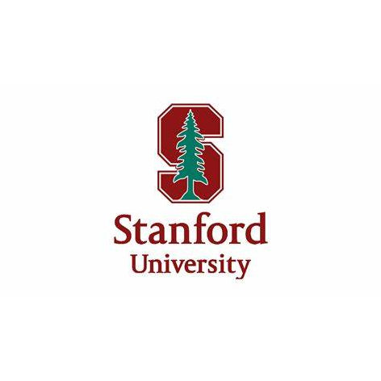

# My Code in Place Learning Journey 🚀

Welcome to my repository documenting my learning journey through Code in Place! This repository contains my weekly assignment code, section meet assignments, lecture worked example files, and is organized into week-wise folders. Code in Place is a free introductory programming course that focuses on teaching Python, based on the material from Stanford University's CS106A course.

## What I'll Gain

In my pursuit of enhancing my programming skills and deepening my understanding of Python, I am actively participating in Code in Place. Although I already have some programming experience, this course offers a structured learning path and valuable resources to further develop my proficiency.

## Repository Structure

- `BeforeClass/`: This directory contains assignments that were submitted as part of the selection process before joining the course.
- `CourseAssignments/`: This directory holds the assignments completed during each week of the course. It includes folders for Week1, Week2, and so on.
- `LectureWorkedExamples/`: This directory contains the worked examples demonstrated during the course lectures. It also includes folders for Week1, Week2, and so on.
- `SectionAssignments/`: This directory holds the assignments related to the section meet sessions. It includes folders for Week1, Week2, and so on.
- `README.md`: This file provides an overview of my learning journey and the repository structure.

I'm excited to embrace this learning opportunity and continue building my programming skills with Code in Place. Through this repository, I aim to showcase my progress and the knowledge gained throughout the course.

Let's embark on this coding adventure together!
